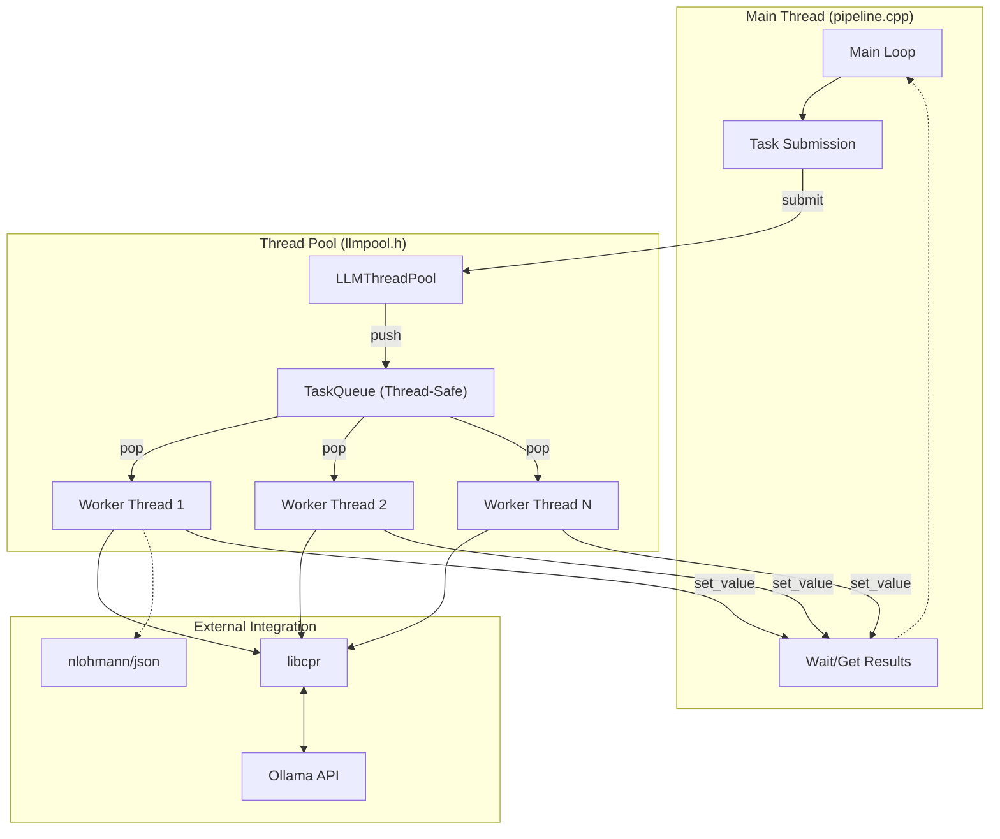

# System Architecture - LLM Pool

This document describes the high-level architecture and components of the `llmpool` project.

## Architecture Diagram

## Component Explanations

### 1. Main Thread (`pipeline.cpp`)
- **Main Loop**: Iterates through the `images/` directory.
- **Task Submission**: Calls `pool.submit()` for each image, passing a lambda that invokes the analysis function.
- **TaskTracker**: A local struct that pairs image paths with their corresponding `std::future<std::string>`.
- **Wait/Get Results**: Blocks on `future.get()` to retrieve the analysis results in sequence, ensuring orderly console output and file saving.

### 2. LLMThreadPool (`llmpool.h`)
- **Workers**: A collection of `std::thread` objects initialized at startup.
- **submit<F, Args>** : A variadic template function that:
    - Wraps the task in a `std::packaged_task`.
    - Retrieves a `std::future` from the task.
    - Pushes a wrapper lambda into the `TaskQueue`.
    - Returns the `std::future` to the caller.

### 3. TaskQueue (`llmpool.h`)
- **Internal Queue**: A `std::queue<std::function<void()>>` protecting the tasks.
- **Synchronization**: Uses `std::mutex` for exclusive access and `std::condition_variable` to coordinate workers (blocking when empty, waking up on new tasks).
- **Graceful Shutdown**: Managed via a `shutting_down_` flag and `notify_all()` to ensure workers exit cleanly when the pool is destroyed.

### 4. Image Analysis Logic (`pipeline.cpp`)
- **analyze_image_with_ollama**: The core functional unit executed by workers.
- **Base64 Encoding**: Prepares binary image data for transmission.
- **JSON Handling**: Uses `nlohmann/json` to construct the payload and parse the response.
- **HTTP Communication**: Employs `libcpr` (C++ Requests) for synchronous POST requests to the Ollama endpoint (`/api/generate`).

### 5. Dependency Layer
- **libcpr**: A wrapper around `libcurl`, providing a modern, "Python-requests-like" interface for C++.
- **nlohmann/json**: A header-only library for intuitive JSON manipulation.
- **Ollama**: An external service that hosts and runs the vision models (`qwen3-vl:latest`).
